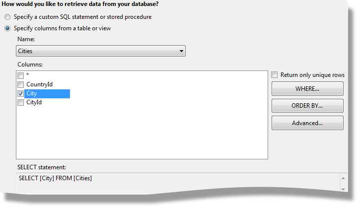
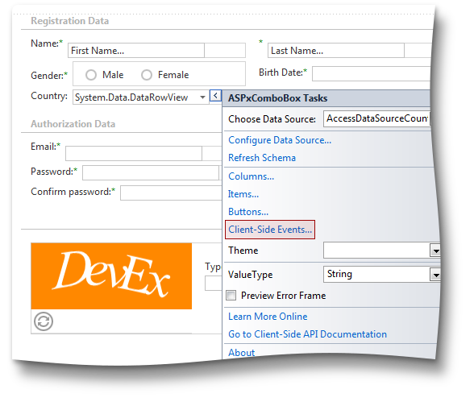
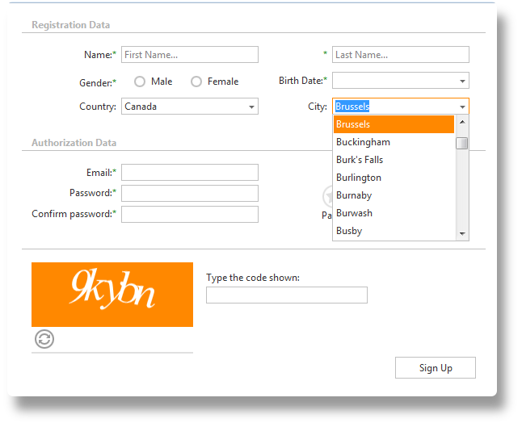
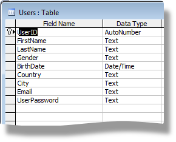

<!-- default badges list -->

[](https://supportcenter.devexpress.com/ticket/details/E4749)
[](https://docs.devexpress.com/GeneralInformation/403183)
<!-- default badges end -->

# Editors for ASP.NET Web Forms - Create a registration form

This example contains a tutorial for creating a registration form with the DevExpress ASP.NET Web Forms Editors from scratch.

We will use the following input fields in our registration form:  
  
1. **First Name** (a required field).  
2. **Last Name** (a required field).  
3. **Gender** (a required field with two predefined choices: Male, Female).  
4. **Birth Date** (a required field).  
5. **Country** (an optional field). An end-user can select a country from a list given by a country database.  
6. **City** (an optional field). An end-user can select a city from a list given by a city database. The list should only display cities in the selected country.  
7. **Email** address (a required unique field). The entered text should be formatted as an email address, i.e. \<sometext\>@\<sometext\>.\<sometext\>. To ensure uniqueness, a user should be able to check if the address was previously used to create an account.  
8. **Password** (a required field). To ensure security, a password should meet basic requirements: password length of 3 or more characters and a combination of numbers, capital and lower case. We will add a custom mechanism for verifying password safety.  
9. **Confirm password** (a required field). Since the password is masked, a confirmation field guarantees the password is free of typos. This field value should equal the Password value.  
10. **Captcha** (a required field) provides protection against automated input.  
11. **Sign Up** button. Invokes the registration process. The end-user cannot submit the form with invalid input or unfilled required fields.  
  
By the end of this tutorial we will have a page with the following registration form:  
  
  
## Tools and frameworks
We use **Visual Studio 2010** and target **.NET Framework 4.0**. Data is stored in a **Microsoft Office Access 2003** database file. Please note our database data is randomly generated mock data.
  
## Navigating the tutorial
  
This example is arranged in six sections and contains a project for each section.

* [1. Create the registration form layout]() (result code: [ASPxEditorsTutorial.Step1](CS/ASPxEditorsTutorial.Step1))
* [2. Customize editors and add built-in client-side validation]() (result code: [ASPxEditorsTutorial.Step2](CS/ASPxEditorsTutorial.Step2))
* [3. Add a Cascading Combo Boxes feature]() (result code: [ASPxEditorsTutorial.Step3](CS/ASPxEditorsTutorial.Step3))
* [4. Save data to database]() (result code: [ASPxEditorsTutorial.Step4](CS/ASPxEditorsTutorial.Step4))
* [5. Implement the password verification mechanism]() (result code: [ASPxEditorsTutorial.Step5](CS/ASPxEditorsTutorial.Step5))
* [6. Check the entered email address]() (result code: [ASPxEditorsTutorial.Step6](CS/ASPxEditorsTutorial.Step6))
## 1. Create the registration form layout 
### 1.1. Create a project
  
Let's start by creating a new project. Open Visual Studio and click **File -\> New -\> Project...**  
  
  
Choose the **DevExpress v13.2 Template Gallery** project:  
  
  
  
Choose the **WebApplication** option and press the **Run Wizard** button:  
  
  
  
In the **Choose Layout** tab select the ***Empty*** project option:  
  
  
  
In the **Choose Theme** tab, select the ***Metropolis*** theme and press the **Create Project** button:  
  
  
  
### 1.2. Add a new Form
  
Add a new page named **RegistrationForm**:  
  
  
We will use the following editors on the registration form :  
  
[ASPxTextBox](http://documentation.devexpress.com/#AspNet/CustomDocument11586) for the First Name, Last Name, Email, Password and Confirm Password fields.  
[ASPxRadioButtonList](http://documentation.devexpress.com/#AspNet/CustomDocument10778) for the Gender field.  
[ASPxDateEdit](http://documentation.devexpress.com/#AspNet/CustomDocument11628) for the Birth Date field.  
[ASPxComboBox](http://documentation.devexpress.com/#AspNet/CustomDocument11418) for the Country and City fields.  
[ASPxCaptcha](http://documentation.devexpress.com/#AspNet/CustomDocument11118) to protect against automated form filling.  
[ASPxButton](http://documentation.devexpress.com/#AspNet/CustomDocument11620) to perform form submission  
  
We also use [ASPxLabel](http://documentation.devexpress.com/#AspNet/CustomDocument11590) to display some additional information and an [ASPxRatingControl](http://documentation.devexpress.com/#AspNet/clsDevExpressWebASPxRatingControlASPxRatingControltopic) to display a password safety indicator.  
  
### 1.3. Create a page layout
  
We will use  [ASPxFormLayout](http://documentation.devexpress.com/#AspNet/clsDevExpressWebASPxFormLayoutASPxFormLayouttopic) to construct the registration form layout. Drop the **ASPxFormLayout** control onto the page from the **DX.13.2: Navigation & Layout** Toolbox tab::  
  
  
  
Set its **ID** to "registrationFormLayout" and **Width** to ***600px***:  
  
  
  
Watch the [ASP.NET Form Layout - Getting Started](https://www.youtube.com/watch?v=I2lU7SS3BaY) video tutorial to see how to easily create a page layout with ASPxFormLayout. We can create our layout in the same way.  
Select the ***Edit Layout...*** option in the ***Smart tag*** of ASPxFormLayout to open layout designer:  
  
  
Create a new layout group and set the following properties:  
  
Add layout item with ASPxTextBox inside to the Layout Group:  
  
Set the layout item's caption to ***Name***:  
  
Follow the same steps to add a layout item for ***Last Name*** with ASPxTextBox, ***Gender*** with ASPxRadioButtonList and ***Birth Date*** with ASPxDateEdit. Now, press ***OK*** to exit the ASPxFormLayout Items Editor.  
Set the ID property and adjust the width of each editor. For the ASPxRadioButtonList, create two items - ***Male*** and ***Female***:  
  
  
  
Set its **RepeatDirection** property to ***Horizontal***, **Width** to ***170px*** and **Border.BorderStyle** to ***None***. As a result, you'll get the following markup:  
  
```aspx  
<dx:ASPxRadioButtonList ID="genderRadioButtonList" runat="server" RepeatDirection="Horizontal"  
    Width="170px">  
    <Items>  
        <dx:ListEditItem Text="Male" Value="Male" />  
        <dx:ListEditItem Text="Female" Value="Female" />  
    </Items>  
    <Border BorderStyle="None" />  
</dx:ASPxRadioButtonList>  
```  
  
  
Let's create two additional groups in the same way:  
***Authorization Data*** group, containing the following items:  
     - ***Email*** (contains ASPxTextBox);  
     - ***Check email*** (empty for now, it will be customized in [Part 6 of this tutorial](https://supportcenter.devexpress.com/internal/ticket/details/KA18768#));  
     - ***Password*** (contains ASPxTextBox);  
     - ***Password safety*** (contains ASPxRatingControl, this item does not have a caption);  
     - ***Confirm password*** (contains ASPxTextBox);  
**Submit** group, containing these controls:  
     - ***Captcha*** (contains ASPxCaptcha, this item does not have a caption));  
     - ***SignUp*** (contains ASPxButton);  
  
> [!NOTE]
> You may choose to create groups by copying the markup of previously created items and changing attribute values as necessary. 
  
With the form fields created, the markup is as follows:  
  
```aspx  
<dx:ASPxFormLayout ID="registrationFormLayout" runat="server" AlignItemCaptionsInAllGroups="True"  
    Width="600px">  
    <Items>  
        <dx:LayoutGroup Caption="Registration Data" GroupBoxDecoration="HeadingLine" SettingsItemCaptions-HorizontalAlign="Right"  
            ColCount="2">  
            <Items>  
                <dx:LayoutItem Caption="Name">  
                    <LayoutItemNestedControlCollection>  
                        <dx:LayoutItemNestedControlContainer>  
                            <dx:ASPxTextBox ID="firstNameTextBox" runat="server" Width="170px">  
                            </dx:ASPxTextBox>  
                        </dx:LayoutItemNestedControlContainer>  
                    </LayoutItemNestedControlCollection>  
                </dx:LayoutItem>  
                <dx:LayoutItem Caption="Last Name">  
                    <LayoutItemNestedControlCollection>  
                        <dx:LayoutItemNestedControlContainer>  
                            <dx:ASPxTextBox ID="lastNameTextBox" runat="server" Width="170px">  
                            </dx:ASPxTextBox>  
                        </dx:LayoutItemNestedControlContainer>  
                    </LayoutItemNestedControlCollection>  
                </dx:LayoutItem>  
                <dx:LayoutItem Caption="Gender">  
                    <LayoutItemNestedControlCollection>  
                        <dx:LayoutItemNestedControlContainer>  
                            <dx:ASPxRadioButtonList ID="genderRadioButtonList" runat="server" RepeatDirection="Horizontal"  
                                Width="170px">  
                                <Items>  
                                    <dx:ListEditItem Text="Male" Value="Male" />  
                                    <dx:ListEditItem Text="Female" Value="Female" />  
                                </Items>  
                                <Border BorderStyle="None" />  
                            </dx:ASPxRadioButtonList>  
                        </dx:LayoutItemNestedControlContainer>  
                    </LayoutItemNestedControlCollection>  
                </dx:LayoutItem>  
                <dx:LayoutItem Caption="Birth Date">  
                    <LayoutItemNestedControlCollection>  
                        <dx:LayoutItemNestedControlContainer>  
                            <dx:ASPxDateEdit ID="birthDateEdit" runat="server">  
                            </dx:ASPxDateEdit>  
                        </dx:LayoutItemNestedControlContainer>  
                    </LayoutItemNestedControlCollection>  
                </dx:LayoutItem>  
                <dx:LayoutItem Caption="Country">  
                    <LayoutItemNestedControlCollection>  
                        <dx:LayoutItemNestedControlContainer>  
                            <dx:ASPxComboBox runat="server" ID="countryComboBox">  
                            </dx:ASPxComboBox>  
                        </dx:LayoutItemNestedControlContainer>  
                    </LayoutItemNestedControlCollection>  
                </dx:LayoutItem>  
            </Items>  
            <SettingsItemCaptions HorizontalAlign="Right"></SettingsItemCaptions>  
        </dx:LayoutGroup>  
        <dx:LayoutGroup Caption="Authorization Data" GroupBoxDecoration="HeadingLine" SettingsItemCaptions-HorizontalAlign="Right"  
            ColCount="2">  
            <Items>  
                <dx:LayoutItem Caption="Email">  
                    <LayoutItemNestedControlCollection>  
                        <dx:LayoutItemNestedControlContainer>  
                            <dx:ASPxTextBox runat="server" ID="eMailTextBox" Width="170px">  
                            </dx:ASPxTextBox>  
                        </dx:LayoutItemNestedControlContainer>  
                    </LayoutItemNestedControlCollection>  
                </dx:LayoutItem>  
                <dx:LayoutItem Caption="Check email" ShowCaption="False">  
                    <LayoutItemNestedControlCollection>  
                        <dx:LayoutItemNestedControlContainer>  
                        </dx:LayoutItemNestedControlContainer>  
                    </LayoutItemNestedControlCollection>  
                </dx:LayoutItem>  
                <dx:LayoutItem Caption="Password">  
                    <LayoutItemNestedControlCollection>  
                        <dx:LayoutItemNestedControlContainer>  
                            <dx:ASPxTextBox ID="passwordTextBox" runat="server" Width="170px">  
                            </dx:ASPxTextBox>  
                        </dx:LayoutItemNestedControlContainer>  
                    </LayoutItemNestedControlCollection>  
                </dx:LayoutItem>  
                <dx:LayoutItem Caption="Layout Item" RowSpan="2" ShowCaption="False">  
                    <LayoutItemNestedControlCollection>  
                        <dx:LayoutItemNestedControlContainer>  
                            <dx:ASPxRatingControl ID="ratingControl" runat="server" ReadOnly="True" Value="0">  
                            </dx:ASPxRatingControl>  
                            <dx:ASPxLabel ID="ratingLabel" runat="server" Text="Password safety">  
                            </dx:ASPxLabel>  
                        </dx:LayoutItemNestedControlContainer>  
                    </LayoutItemNestedControlCollection>  
                </dx:LayoutItem>  
                <dx:LayoutItem Caption="Confirm password">  
                    <LayoutItemNestedControlCollection>  
                        <dx:LayoutItemNestedControlContainer ID="LayoutItemNestedControlContainer1" runat="server"  
                            SupportsDisabledAttribute="True">  
                            <dx:ASPxTextBox ID="confirmPasswordTextBox" runat="server" Width="170px">  
                            </dx:ASPxTextBox>  
                        </dx:LayoutItemNestedControlContainer>  
                    </LayoutItemNestedControlCollection>  
                </dx:LayoutItem>  
            </Items>  
            <SettingsItemCaptions HorizontalAlign="Right"></SettingsItemCaptions>  
        </dx:LayoutGroup>  
        <dx:LayoutGroup Caption="Submit" GroupBoxDecoration="HeadingLine" SettingsItemCaptions-HorizontalAlign="Right"  
            ShowCaption="False">  
            <Items>  
                <dx:LayoutItem Caption="Layout Item" ShowCaption="False">  
                    <LayoutItemNestedControlCollection>  
                        <dx:LayoutItemNestedControlContainer ID="LayoutItemNestedControlContainer2" runat="server"  
                            SupportsDisabledAttribute="True">  
                            <dx:ASPxCaptcha ID="Captcha" runat="server" Width="100%">  
                                <ChallengeImage ForegroundColor="#000000">  
                                </ChallengeImage>  
                            </dx:ASPxCaptcha>  
                        </dx:LayoutItemNestedControlContainer>  
                    </LayoutItemNestedControlCollection>  
                </dx:LayoutItem>  
                <dx:LayoutItem Caption="SignUp" ShowCaption="False">  
                    <LayoutItemNestedControlCollection>  
                        <dx:LayoutItemNestedControlContainer ID="LayoutItemNestedControlContainer3" runat="server"  
                            SupportsDisabledAttribute="True">  
                            <dx:ASPxButton ID="signUp" runat="server" Text="Sign Up" Width="100px">  
                            </dx:ASPxButton>  
                        </dx:LayoutItemNestedControlContainer>  
                    </LayoutItemNestedControlCollection>  
                </dx:LayoutItem>  
            </Items>  
            <SettingsItemCaptions HorizontalAlign="Right"></SettingsItemCaptions>  
        </dx:LayoutGroup>  
    </Items>  
</dx:ASPxFormLayout>  
```  
  
Build and run the web application. For now, our registration from should look like this:  
  
  
  

## 2. Customize editors and add built-in client-side validation. 
  
### 2.1. Add null text for text boxes
  
  
Let's assume we want to show a "watermark" in empty text boxes as follows.  
  
We will use the **NullText** property for this purpose. The null text is a prompt displayed in the editor input box when the editor is unfocused and its value is null. Assign the value ***First Name...*** to the **NullText** property of the ***firstNameTextBox*** ASPxTextbox:  
  
  
  
For the ***lastNameTextBox*** ASPxTextbox set the **NullText** to ***Last Name...*** in the same manner.  
  
Our editors now look like the following screen:  
  
  
  
### 2.2.Bind the ASPxComboBox control to a data source
  
Now let's create a combo box that will allow end-users select a country from a list.  
  
Download the attached ***WorldCities.mdb*** database file and add it to the **App\_Data** folder of your project (create this folder yourself if it does not exist). Then drop a **AccessDataSource** control onto the form and set its ID to ***AccessDataSourceCountry***:  
  
  
  
Bind ***AccessDataSourceCountry*** to our database file from the **"Configure Data Source..."** option:  
  
  
  
Click the Browse button, select the ***WorldCities.mdb*** file and press **OK**:  
  
  
  
Select the **"Specify columns from a table or view"** option. Select the ***Countries*** table from the drop-down list and press **Next**.  
  
  
Press the **Finish** button. The data source markup will look like:  
  
```aspx  
<asp:AccessDataSource ID="AccessDataSourceCountry" runat="server" DataFile="~/App_Data/WorldCities.mdb" SelectCommand="SELECT * FROM [Countries]" />  
```  
  
Now let's bind the ***countryComboBox*** ASPxComboBox. Set its DataSource property to ***AccessDataSourceCountry***:  
  
  
In the Properties list set the [TextField](http://documentation.devexpress.com/#AspNet/DevExpressWebASPxEditorsASPxComboBox_TextFieldtopic) and [ValueField](http://documentation.devexpress.com/#AspNet/DevExpressWebASPxEditorsASPxComboBox_ValueFieldtopic) properties to ***Country***.  Now we can choose a country from our editor:  
  
  
Set the [IncrementalFilteringMode](http://documentation.devexpress.com/#AspNet/DevExpressWebASPxEditorsASPxComboBox_IncrementalFilteringModetopic) property to ***StartsWith*** to allow end-users to search while typing a country name:  
  
  

### 2.3. Setting built-in client-side validation
  
Our registration form needs some required fields. We can add client-side validation for our editors to prevent end-user submission of empty values for required fields. Leaving a required field empty will display a corresponding error.  
Enable client-side validation by setting the following properties at the [ValidationSettings](http://documentation.devexpress.com/#AspNet/clsDevExpressWebASPxEditorsValidationSettingstopic) property:  
  
- The **Display** property to ***Dynamic***;  
- The **ErrorDisplayMode** property to***Text***;  
- The **SetFocusOnError** property to ***True***;  
- The **RequiredField.IsRequired** property to ***True***.  
  
  
Here's the ***firstNameTextBox*** markup:  
  
```aspx  
<dx:ASPxTextBox ID="firstNameTextBox" runat="server" NullText="First Name..." Width="170px">  
    <ValidationSettings Display="Dynamic" ErrorDisplayMode="Text" SetFocusOnError="True">  
        <RequiredField IsRequired="True" />  
    </ValidationSettings>  
</dx:ASPxTextBox>  
```  
  
Specify the same settings for the ***lastNameTextBox***, ***genderRadioButtonList*** and ***birthDateEdit*** editors. For the ***Email***, ***Password*** and ***Confirm Password*** fields also set the ***RequiredField.ErrorText\="The value is required"*** and ***ErrorTextPosition\="Bottom"*** values.  
  
To validate an entered Email, add a regular expression that will determine if typed text is formatted as an email address. Select the **RegularExpression.ValidationExpression** property and choose the ***Internet e-mail address*** value:  
  
  
  
### 2.4. Setting the ASPxDateEdit's calendar initial date
  
We use ASPxDateEdit for the end-user's birth date. However, when we open the editor's calendar, it displays the current date. Let's change the initial visible date. We will use the [Client-Side Functionality](http://documentation.devexpress.com/#AspNet/CustomDocument6908) of our controls to manipulate controls on the client side.  
  
Handle the client-side [ASPxClientDateEdit.Init](http://documentation.devexpress.com/#AspNet/DevExpressWebASPxClassesScriptsASPxClientControl_Inittopic) event using the ASPxDateEdit's Smart tag:  
  
  
  
  
Select the **Init** event and add the following code:  
  
```js  
function(s, e){  
    s.GetCalendar().SetVisibleDate(new Date (1995,1,1));  
}  
```  
  
  
  
where **s** is a sender of the handled event and **e** is the event's arguments.  
  
The resulting markup:  
  
```aspx  
<dx:ASPxDateEdit ID="birthDateEdit" runat="server">  
    <ValidationSettings Display="Dynamic" ErrorDisplayMode="Text" SetFocusOnError="True">  
        <RequiredField IsRequired="True" />  
    </ValidationSettings>  
    <ClientSideEvents Init="function(s, e){  s.GetCalendar().SetVisibleDate(new Date (1995,1,1)); }" />  
</dx:ASPxDateEdit>  
```  
  
  
### 2.5. Additional customization
  
Our ASPxRatingControl reports a programmatically calculated password safety score. Thus, we should not allow end-users to set its value. For this purpose, set the [ASPxRatingControl.ReadOnly](http://documentation.devexpress.com/#AspNet/DevExpressWebASPxRatingControlASPxRatingControl_ReadOnlytopic) property to ***True***. Set the initial value to ***0*** using the [Value](http://documentation.devexpress.com/#AspNet/DevExpressWebASPxRatingControlASPxRatingControl_Valuetopic) property:  
  
```aspx  
<dx:ASPxRatingControl ID="ratingControl" runat="server" ReadOnly="True" Value="0">  
</dx:ASPxRatingControl>  
```  
  
  
To hide the password entered in the ***Password*** field set the [Password](http://documentation.devexpress.com/#AspNet/DevExpressWebASPxEditorsASPxTextBoxBase_Passwordtopic) property to ***True*** for the ***passwordTextBox*** and ***confirmPasswordTextBox*** text boxes:  
  
```aspx  
<dx:ASPxTextBox ID="passwordTextBox" runat="server" Password="True" Width="170px">  
    <ValidationSettings Display="Dynamic" ErrorDisplayMode="Text" ErrorTextPosition="Bottom"  
        SetFocusOnError="True">  
        <RequiredField ErrorText="The value is required" IsRequired="True" />  
    </ValidationSettings>  
</dx:ASPxTextBox>  
```  
  
To show the ***Sign Up*** button on the right side, wrap it with a ***div*** container with the ***float: right*** property:  
  
```aspx  
<div style="float: right">  
    <dx:ASPxButton ID="signUp" runat="server" Text="Sign Up" Width="100px">  
    </dx:ASPxButton>  
</div>  
```  
  
Finally, we can hide the ***Last Name*** caption. Add the ***ShowCaption\="False"***property to its item:  
  
```aspx  
<dx:LayoutItem Caption="Last Name" ShowCaption="False">  
    <LayoutItemNestedControlCollection>  
        <dx:LayoutItemNestedControlContainer>  
            <dx:ASPxTextBox ID="lastNameTextBox" runat="server" NullText="Last Name..." Width="170px">  
                <ValidationSettings Display="Dynamic" ErrorDisplayMode="Text" SetFocusOnError="True">  
                    <RequiredField IsRequired="True" />  
                </ValidationSettings>  
            </dx:ASPxTextBox>  
        </dx:LayoutItemNestedControlContainer>  
    </LayoutItemNestedControlCollection>  
</dx:LayoutItem>  
```  
  
The resulting form:  
  
  
  
## 3. Add a Cascading Combo Boxes feature
  
In this section we retrieve a list of cities in the selected country. If a user chooses a country in the first combo box, the second combo box contains cities in the selected country. We call this control dependence "Cascading Combo Boxes".  

### 3.1. Create a data source for a cascading combo box
  
Drop an **AccessDataSource** control onto the page and set its **ID** to ***AccessDataSourceCities*** (the previous article describes how). Select the **Configure Data Source...** smart tag option and choose the ***WorldCities.mdb*** data file. Then select the ***City*** field in the ***Cities*** data table:  
  
  
  
Click ***WHERE...*** and add a select parameter as follows:  
  
  
Click **Add** and then **OK**:  
  
  
Click **Next** and **Finish**. The resulting markup is the following:  
  
```aspx  
<asp:AccessDataSource ID="AccessDataSourceCities" runat="server" DataFile="~/App_Data/WorldCities.mdb"  
    SelectCommand="SELECT [City] FROM [Cities] WHERE ([CountryId] = ?)">  
    <SelectParameters>  
        <asp:Parameter Name="CountryId" Type="Int32" />  
    </SelectParameters>  
</asp:AccessDataSource>  
```  
  
### 3.2. Add the 'City' ASPxComboBox
  
Then let's add one more layout item containing an ASPxComboBox. Open the ASPxFormLayout's designer and add a Layout item with a nested ASPxComboBox to the ***Registration Data*** group:  
  
Set the newly created item's **Caption** property to ***City***:  
  
  
  
Set the editor's **ID** to ***cityComboBox***, **DataSourceID** to ***AccessDataSourceCities***, **IncrementalFilteringMode** to ***StartsWith*** and **TextField** and **ValueField** to ***City*** by analogy with the countryComboBox editor.  
Finally, set the [ClientInstanceName](http://documentation.devexpress.com/#AspNet/DevExpressWebASPxEditorsASPxEditBase_ClientInstanceNametopic) property to ***cityClientComboBox***.  
  
> [!NOTE]
> The ClientInstanceName property names the client-side instance of the control. You can access the name on the client side as a JavaScript variable to reference the control instance.*  
  
The resulting markup of the **City** item follows:  
  
```aspx  
<dx:LayoutItem Caption="City">  
    <LayoutItemNestedControlCollection>  
        <dx:LayoutItemNestedControlContainer ID="LayoutItemNestedControlContainer1" runat="server"  
            SupportsDisabledAttribute="True">  
            <dx:ASPxComboBox ID="cityComboBox" runat="server" ClientInstanceName="cityClientComboBox"  
                DataSourceID="AccessDataSourceCities" IncrementalFilteringMode="StartsWith" OnCallback="cityComboBox_Callback"  
                TextField="City" ValueField="City">  
            </dx:ASPxComboBox>  
        </dx:LayoutItemNestedControlContainer>  
    </LayoutItemNestedControlCollection>  
</dx:LayoutItem>  
```  
  
  
### 3.3. Send a callback to the cascaded combobox
  
Now, let's return to our ***countryComboBox***. After selecting a country, we need to perform a server request to bind the ***cityComboBox*** to a list of cities in the selected country. We can perform a custom callback using the [ASPxClientComboBox.PerformCallback](http://documentation.devexpress.com/#AspNet/DevExpressWebASPxEditorsScriptsASPxClientComboBox_PerformCallbacktopic) method. Get the selected combo box value with the [GetValue](http://documentation.devexpress.com/#AspNet/DevExpressWebASPxEditorsScriptsASPxClientEditBase_GetValuetopic) method.  
  
> [!NOTE]
> Refer to the following documentation article for more information on callbacks: [Callbacks](https://docs.devexpress.com/AspNet/402559/common-concepts/callbacks)
  
Open the ***Client Side Events...*** dialog in the ***countryComboBox*** Smart Tag...  
  
...and add the ***cityClientComboBox.PerformCallback(s.GetValue());*** string to the client-side [SelectedIndexChanged](http://documentation.devexpress.com/#AspNet/DevExpressWebASPxEditorsScriptsASPxClientComboBox_SelectedIndexChangedtopic) event:  
  
  
  
Here we use the ClientInstanceName property on the cityClientComboBox editor to reference it client-side to call its custom callback.
  
This is the resulting markup of ***countryComboBox*** editor:  
  
```aspx  
<dx:ASPxComboBox runat="server" ID="countryComboBox" DataSourceID="AccessDataSourceCountry"  
    TextField="Country" ValueField="CountryID" IncrementalFilteringMode="StartsWith">  
    <ClientSideEvents SelectedIndexChanged="function(s, e) { cityClientComboBox.PerformCallback(s.GetValue()); }" />  
</dx:ASPxComboBox>  
```  
  
### 3.4. Update the cascaded combobox data source
  
Now we need to process the callback request on the server side. Handle the [Callback](https://docs.devexpress.com/AspNet/DevExpress.Web.ASPxAutoCompleteBoxBase.Callback) event of the ***cityComboBox*** editor. Double-click to the **Callback** event in the In the **Properties list -\> Event tab**:  
  
We sent the selected country identifier as the custom callback argument to the server. In the **Callback** event handler, use **e.Parameter** to retrieve the country identifier and send it to the data source as a Select Parameter to get a cities list:  
  
```cs  
protected void cityComboBox_Callback(object sender, DevExpress.Web.ASPxClasses.CallbackEventArgsBase e) {  
    if(string.IsNullOrEmpty(e.Parameter)) return;  
    AccessDataSourceCities.SelectParameters[0].DefaultValue = e.Parameter;  
    cityComboBox.DataBind();  
}  
```  
  
Now our Cascading Combo Boxes are ready. When we select a country in the first combo, the second combo box only displays cities in the selected country:  
  

## 4. Save data to database

In this section we implement a mechanism to save registration input to a database. In addition we create a page with a list of registered users.  

### 4.1. Save data to the database.

Download the attachment and add the ***UsersDB.mdb*** file to the **App\_Data** folder of our project. Alternatively, you can copy this database file from the **App\_Data** folder of the “ASPxEditorsTutorial.Step4” project. The ***UsersDB.mdb*** file contains a ***Users*** table with the following structure:  
  
  
  
  
  
> [!NOTE]
> We store passwords in a plain-text field for the purposes of this tutorial. In a real project, we recommend only storing a representation of the password in the database. Refer to* [this](http://stackoverflow.com/questions/1054022/best-way-to-store-password-in-database) *thread for more information.  
  
Open the ***web.config*** file and add the following ***connectionStrings*** block to the ***configuration*** section:  
  
```xml  
<configuration>  
    ...  
    <connectionStrings>  
        <add name="UsersConnectionString" connectionString="Provider=Microsoft.Jet.OLEDB.4.0;Data Source=|DataDirectory|\UsersDB.mdb" providerName="System.Data.OleDb" />  
    </connectionStrings>  
    ...  
</configuration>  
```  
  
This connection string connects our project to the database file.  
  
Handle the **Click** event of the ***Sign Up*** button by double-clicking the button in the **Design View**.  
  
```cs  
protected void signUp_Click(object sender, EventArgs e) {  
    if (Captcha.IsValid) {  
        using (OleDbConnection connection = GetConnection()) {  
            OleDbCommand command = new OleDbCommand(string.Empty, connection);  
            command.CommandText = "INSERT INTO [Users] (FirstName, LastName, Gender, BirthDate, Country, City, Email, UserPassword) VALUES (@firstName, @lastName, @gender, @birthDate, @country, @city, @email, @password)";  

            command.Parameters.AddWithValue("firstName", firstNameTextBox.Text);  
            command.Parameters.AddWithValue("lastName", lastNameTextBox.Text);  
            command.Parameters.AddWithValue("gender", genderRadioButtonList.Value);  
            command.Parameters.AddWithValue("birthDate", birthDateEdit.Date.ToShortDateString());  
            command.Parameters.AddWithValue("country", countryComboBox.Text);  
            command.Parameters.AddWithValue("city", cityComboBox.Text);  
            command.Parameters.AddWithValue("email", eMailTextBox.Text);  
            command.Parameters.AddWithValue("password", passwordTextBox.Text);  
            connection.Open();  
            command.ExecuteNonQuery();  
        }  
    }  
}  
```  
  
Add the following function to retrieve the connection string from the ***web.config*** file:  
  
```cs  
private OleDbConnection GetConnection() {  
    OleDbConnection connection = new OleDbConnection();  
    connection.ConnectionString = ConfigurationManager.ConnectionStrings["UsersConnectionString"].ConnectionString;  
    return connection;  
}  
```  
  
Our saving mechanism is ready. We can add a new user to the database from the registration form.  
  
### 4.2. Create a confirmation page.
  
We would like to signal successful registration when an end-user submits the registration form. In this case, let’s redirect to another page. Create a new ***RegisteredPage.aspx*** page with a simple message, for example ***You have been successfully registered!***:  
  
```aspx  
<div style="text-align: center">  
<h1>You have been registered successfully!</h1>  
</div>  
```  
  
To redirect an end-user to this page after registration add the following line to the **Click** event handler of the ***Sign Up*** button:  
  
```cs  
protected void signUp_Click(object sender, EventArgs e) {  
    if(Captcha.IsValid) {  
        using(OleDbConnection connection = GetConnection()) {  
            ...  
        }  
        Response.Redirect("RegisteredPage.aspx");  
    }  
}  
```  
  
Here is the resulting page:  
  
  
  
### 4.3. Show a list of registered users.
  
An administrative page will display the list of registered users. We can use the [ASPxGridView](http://documentation.devexpress.com/#AspNet/clsDevExpressWebASPxGridViewASPxGridViewtopic) control for this purpose. Create the **UsersList.aspx** page. Add the following **AccessDataSource** control to the page:  
  
```aspx  
<asp:AccessDataSource ID="AccessDataSourceUsers" runat="server" DataFile="~/App_Data/UsersDB.mdb" SelectCommand="SELECT * FROM [Users]"></asp:AccessDataSource>  
```  
  
Drag ASPxGridView onto the page from the **DX.13.2: Data & Analytic**s tab and choose the ***AccessDataSourceUsers*** in the grid's **Choose Data Source** option. The columns are automatically added:  
  
  
We now have the following markup:  
  
```aspx  
<dx:ASPxGridView ID="ASPxGridView1" runat="server" AutoGenerateColumns="False" DataSourceID="AccessDataSourceUsers"  
    KeyFieldName="UserID">  
    <Columns>  
        <dx:GridViewDataTextColumn FieldName="UserID" ReadOnly="True" >  
            <EditFormSettings Visible="False" />  
        </dx:GridViewDataTextColumn>  
        <dx:GridViewDataTextColumn FieldName="FirstName" />  
        <dx:GridViewDataTextColumn FieldName="LastName" />  
        <dx:GridViewDataTextColumn FieldName="Gender" />  
        <dx:GridViewDataDateColumn FieldName="BirthDate" />  
        <dx:GridViewDataTextColumn FieldName="Country" />  
        <dx:GridViewDataTextColumn FieldName="City" />  
        <dx:GridViewDataTextColumn FieldName="Email" />  
        <dx:GridViewDataTextColumn FieldName="UserPassword" />  
    </Columns>  
</dx:ASPxGridView>  
<asp:AccessDataSource ID="AccessDataSourceUsers" runat="server" DataFile="~/App_Data/UsersDB.mdb"  
    SelectCommand="SELECT * FROM [Users]">  
</asp:AccessDataSource>  
```  
  
The user list is displayed as follows:  
  
  
### 4.4. Adding links to navigate between pages.
  
We need to add links for end-user navigation between pages. Drop a ASPxHyperLink from the **Common controls** tab onto the user list page. This link will point back to the registration form. Set the **Text** property to ***\<- Back to the Registration Form*** and the **NavigateUrl** property to ***RegistrationForm.aspx***.  
  
```aspx  
<dx:ASPxHyperLink ID="backHyperLink" runat="server" Text="<- Back to the Registration Form" NavigateUrl="RegistrationForm.aspx" />  
```  
  
Here is the full markup of our ***UsersList.aspx*** page:  
  
```aspx  
<dx:ASPxHyperLink ID="backHyperLink" runat="server" Text="<- Back to the Registration Form" NavigateUrl="RegistrationForm.aspx" />  
<br />  
<dx:ASPxGridView ID="ASPxGridView1" runat="server" AutoGenerateColumns="False" DataSourceID="AccessDataSourceUsers"  
    KeyFieldName="UserID">  
    <Columns>  
        <dx:GridViewDataTextColumn FieldName="UserID" ReadOnly="True" >  
            <EditFormSettings Visible="False" />  
        </dx:GridViewDataTextColumn>  
        <dx:GridViewDataTextColumn FieldName="FirstName"/>  
        <dx:GridViewDataTextColumn FieldName="LastName" />  
        <dx:GridViewDataTextColumn FieldName="Gender" />  
        <dx:GridViewDataDateColumn FieldName="BirthDate" />  
        <dx:GridViewDataTextColumn FieldName="Country" />  
        <dx:GridViewDataTextColumn FieldName="City" />  
        <dx:GridViewDataTextColumn FieldName="Email" />  
        <dx:GridViewDataTextColumn FieldName="UserPassword" />  
    </Columns>  
</dx:ASPxGridView>  
<asp:AccessDataSource ID="AccessDataSourceUsers" runat="server" DataFile="~/App_Data/UsersDB.mdb"  
    SelectCommand="SELECT * FROM [Users]">  
</asp:AccessDataSource>  
```  
  
Now drag the ASPxHyperlink to the ***RegistrationForm.aspx*** page to allow navigating to the user list from our registration form (we add this link for the purposes of this tutorial) and set the following properties:  
  
```aspx  
<dx:ASPxHyperLink ID="hyperLinkUsersPage" runat="server" Text="Check users list"  
    NavigateUrl="UsersList.aspx">  
</dx:ASPxHyperLink>  
```  
  
Repeat the previous step for ***RegisteredPage.aspx***; add ASPxHyperLinks pointing to the ***UsersList.aspx*** and the ***RegistrationForm.aspx*** pages. The resulting markup is as follows:  
  
```aspx  
<div style="text-align: center">  
    <h1>You have been registered successfully!</h1>  
    <dx:ASPxHyperLink ID="hyperLinkUsersPage" runat="server" Text="Check users list"  
        NavigateUrl="UsersList.aspx">  
    </dx:ASPxHyperLink>  
    <br />  
    <dx:ASPxHyperLink ID="hyperLinkRegForm" runat="server" Text="Try again" NavigateUrl="RegistrationForm.aspx">  
    </dx:ASPxHyperLink>  
</div>  
```  
  
Now we can save user registration to the database and review the existing user list:  
  
  
  
## 5. Implement the password verification mechanism
  
In this section we implement a password verification mechanism. We assess password strength from the presence of a mix of characters and overall length. Based on this, we prohibit submission of simplistic passwords. Finally, we add a function to confirm the input password by confirming the passwords match.  

### 5.1. Password strength calculation
  
Add the JavaScript section inside the **head** tag:  
  
```aspx  
<head runat="server">  
    <title></title>  
    <script type="text/javascript">  
       ...  
    </script>  
</head>  
```  
  
In this section we will add client-side functions and event handlers. First, let's create a **GetPasswordStrength** function that will accept the password and return password 'strength' on a five point scale. If the password is less than a specified length (in our case 6), the password safety rating is 1 (unsafe). The safety rating increases if the password contains uppercase letters, lowercase letters, numbers and special characters:  
  
```js  
var passwordMinLength = 6;  
function GetPasswordStrength(password) {  
    var result = 0;  
    if (password) {  
        result++;  
        if (password.length >= passwordMinLength) {  
            if (/[a-z]/.test(password))  
                result++;  
            if (/[A-Z]/.test(password))  
                result++;  
            if (/\d/.test(password))  
                result++;  
            if (!(/^[a-z0-9]+$/i.test(password)))  
                result++;  
        }  
    }  
    return result;  
}  
```  
Now create a function that accepts password strength and updates the representation of the ***ratingControl*** and the description of the ***ratingLabel*** to signal password strength to the end-user. Set the **ClientInstanceName** property of ***ratingControl*** to "ratingControl" and ***ratingLabel*** to "ratingLabel".  
  
  
### 5.2. Display the result of password verification 
  
Use the **SetValue** method to set a value for the ***ratingControl*** and ***ratingLabel*** editors. The ***ApplyPasswordStrength*** function is as follows:  
  
```js  
function ApplyPasswordStrength(value) {  
    ratingControl.SetValue(value);  
    switch (value) {  
        case 0:  
            ratingLabel.SetValue("Password safety");  
            break;  
        case 1:  
            ratingLabel.SetValue("Too simple");  
            break;  
        case 2:  
            ratingLabel.SetValue("Not safe");  
            break;  
        case 3:  
            ratingLabel.SetValue("Normal");  
            break;  
        case 4:  
            ratingLabel.SetValue("Safe");  
            break;  
        case 5:  
            ratingLabel.SetValue("Very safe");  
            break;  
        default:  
            ratingLabel.SetValue("Password safety");  
    }  
}  
```  
  
Next, create a function **ApplyCurrentPasswordStrength** to handle the client-side  [Init](http://documentation.devexpress.com/#AspNet/DevExpressWebASPxClassesScriptsASPxClientControl_Inittopic) and [KeyUp](http://documentation.devexpress.com/#AspNet/DevExpressWebASPxEditorsScriptsASPxClientTextEdit_KeyUptopic) events of the **passwordTextBox** editor. Select its **Client-Side Events...** option and specify the function name as the handler for the necessary events:  
  
  
  
The function in now a handler of the **Init** and **KeyUp** client-side events. The function body can be implemented inside the JavaScript block in page markup:  
  
```js  
function ApplyCurrentPasswordStrength(s, e) {  
    var password = passwordTextBox.GetText();  
    var passwordStrength = GetPasswordStrength(password);  
    ApplyPasswordStrength(passwordStrength);  
}  
```  
  
End-users will now see an indicator of password strength:  
  
  
### 5.3. Implement password length validation 
  
We can now reject weak passwords. We will also require the password to equal the Confirm password field before accepting the value.  
  
For this purpose, call the ***OnPassValidation*** function from the [Validation](http://documentation.devexpress.com/#AspNet/DevExpressWebASPxEditorsScriptsASPxClientEdit_Validationtopic) event handler of the ***passwordTextBox*** and ***confirmPasswordTextBox*** editors (in the same way as we did above). Implement the ***OnPassValidation*** function:  
  
```js  
function OnPassValidation(s, e) {  
    var errorText = GetErrorText(s);  
    if (errorText) {  
        e.isValid = false;  
        e.errorText = errorText;  
    }  
}  
```  
  
The **GetErrorText** function returns an error text depending on an editor and value:  
  
```js  
function GetErrorText(editor) {  
    if (editor === passwordTextBox) {  
        if (ratingControl.GetValue() === 1)  
            return "The password is too simple";  
    } else if (editor === confirmPasswordTextBox) {  
        if (passwordTextBox.GetText() !== confirmPasswordTextBox.GetText())  
            return "The passwords you entered do not match";  
    }  
    return "";  
}  
```  
  
That's all! We have implemented the required task. The resulting markup of the password editors is as follows:  
  
```aspx  
<dx:LayoutItem Caption="Password">  
    <LayoutItemNestedControlCollection>  
        <dx:LayoutItemNestedControlContainer>  
            <dx:ASPxTextBox ID="passwordTextBox" runat="server" ClientInstanceName="passwordTextBox"  
                Password="True" Width="170px">  
                <ClientSideEvents Init="ApplyCurrentPasswordStrength" KeyUp="ApplyCurrentPasswordStrength"  
                    Validation="OnPassValidation" />  
                <ValidationSettings Display="Dynamic" ErrorDisplayMode="Text" ErrorTextPosition="Bottom"  
                    SetFocusOnError="True">  
                    <RequiredField ErrorText="The value is required" IsRequired="True" />  
                </ValidationSettings>  
            </dx:ASPxTextBox>  
        </dx:LayoutItemNestedControlContainer>  
    </LayoutItemNestedControlCollection>  
</dx:LayoutItem>  
<dx:LayoutItem Caption="Layout Item" RowSpan="2" ShowCaption="False">  
    <LayoutItemNestedControlCollection>  
        <dx:LayoutItemNestedControlContainer>  
            <dx:ASPxRatingControl ID="ratingControl" runat="server" ClientInstanceName="ratingControl"  
                ReadOnly="True" Value="0">  
            </dx:ASPxRatingControl>  
            <dx:ASPxLabel ID="ratingLabel" runat="server" ClientInstanceName="ratingLabel" Text="Password safety">  
            </dx:ASPxLabel>  
        </dx:LayoutItemNestedControlContainer>  
    </LayoutItemNestedControlCollection>  
</dx:LayoutItem>  
<dx:LayoutItem Caption="Confirm password">  
    <LayoutItemNestedControlCollection>  
        <dx:LayoutItemNestedControlContainer runat="server" SupportsDisabledAttribute="True">  
            <dx:ASPxTextBox ID="confirmPasswordTextBox" runat="server" ClientInstanceName="confirmPasswordTextBox"  
                Password="True" Width="170px">  
                <ClientSideEvents Validation="OnPassValidation" />  
                <ValidationSettings Display="Dynamic" ErrorDisplayMode="Text" ErrorTextPosition="Bottom"  
                    SetFocusOnError="True">  
                    <RequiredField ErrorText="The value is required" IsRequired="True" />  
                </ValidationSettings>  
            </dx:ASPxTextBox>  
        </dx:LayoutItemNestedControlContainer>  
    </LayoutItemNestedControlCollection>  
</dx:LayoutItem>  
```  
  
Our registration form correctly displays the safety rating of a password and prohibits short and otherwise weak passwords. To avoid typos, the form requires an end-user to confirm their input password. The end-user is informed of validation errors:  
  
  
  
  
## 6. Check the entered email address

In this section we'll implement the capability to check if an entered e-mail address already exists in our database. We also add an image button that allows a user to check the availability of an email address without submitting the form. Additionally, we duplicate editor validation on the server side for enhanced security.  
### 6.1 Implement server-side validation for email address

The check for an existing email address must be performed server side since the checked records are in a database. Select the ***eMailTextBox*** editor and handle its server-side [Validation](http://documentation.devexpress.com/#AspNet/DevExpressWebASPxEditorsASPxEdit_Validationtopic) event (by double-clicking to the right of the **Validation** event in the **Events** tab of the **Properties** window):
  
  
  
Add the following code to this event handler:  
  
```cs  
protected void eMailTextBox_Validation(object sender, DevExpress.Web.ASPxEditors.ValidationEventArgs e) {  
    if (!Page.IsCallback) {  
        e.IsValid = e.Value != null;  
        if (!e.IsValid){  
            e.ErrorText = "Email is required";  
            return;  
        }  
        Regex r = new Regex(@"\w+([-+.']\w+)*@\w+([-.]\w+)*\.\w+([-.]\w+)*");  
        e.IsValid = r.IsMatch(e.Value.ToString());  
        if (!e.IsValid){  
            e.ErrorText = "Email is invalid";  
            return;  
        }  
        e.IsValid = !GetIsEmailExist(e.Value.ToString());  
        if (!e.IsValid) {  
            e.ErrorText = "Sorry, this e-mail belongs to an existing account";  
            return;  
        }  
    }  
}  
```  
  
The [e.ErrorText](http://documentation.devexpress.com/#AspNet/DevExpressWebASPxEditorsValidationEventArgs_ErrorTexttopic) is shown to an end-user when a validation error occurs. The [e.IsValid](http://documentation.devexpress.com/#AspNet/DevExpressWebASPxEditorsValidationEventArgs_IsValidtopic) property sets the editor validity based on whether the input email is in use or available. As you can see, we repeated validation of the other conditions server side.  
We now add a capability to verify whether the entered email address is already registered in our database with the following function:  
  
```cs  
private bool GetIsEmailExist(string email) {  
    using(OleDbConnection connection = GetConnection()) {  
        OleDbCommand cmd = new OleDbCommand("SELECT count(*) FROM [Users] WHERE Email = @Email", connection);  
        cmd.Parameters.AddWithValue("Email", email);  
        connection.Open();  
        int total = (Int32)cmd.ExecuteScalar();  
        connection.Close();  
        return total > 0;  
    }  
}  
```  
  
If an end-user fills the form with an unavailable email address and otherwise valid values, the following error is shown after form submission:  
  

### 6.2. Implement the check for email availability
  
We can now add an end-user capability to check for Email availability before form submission. Drop the [ASPxCallback](http://documentation.devexpress.com/#AspNet/clsDevExpressWebASPxCallbackASPxCallbacktopic) component from the **DX.13.2: Components** tab onto the page. We will use it to perform a callback and check on the server side whether the entered email address exists in the database. Set its **ID** and **ClientInstanceName** properties to ***CheckEmailCallback***:  
  
```aspx  
<dx:ASPxCallback ID="CheckEmailCallback" runat="server" ClientInstanceName="CheckEmailCallback">  
</dx:ASPxCallback>  
```  
  
Inside the **Email** layout item, create a table with ***cellpadding\="0" cellspacing\="0"*** properties and two cells. Place the ***eMailTextBox*** editor in the first cell. Set the ***style\="width: 50px; padding-left: 15px;"*** property on the second cell and drop the [ASPxImage](http://documentation.devexpress.com/#AspNet/clsDevExpressWebASPxEditorsASPxImagetopic) control from the **DX.13.2 Common controls** tab in this cell. Set its **ID** and **ClientInstanceName** properties to ***checkEmailImage*** and specify the [ImageUrl](http://documentation.devexpress.com/#AspNet/DevExpressWebASPxEditorsASPxImage_ImageUrltopic), [Width](http://documentation.devexpress.com/#AspNet/DevExpressWebASPxEditorsASPxImageBase_Widthtopic) and [ToolTip](http://documentation.devexpress.com/#AspNet/DevExpressWebASPxEditorsASPxImageBase_ToolTiptopic) properties. You can download the attachment at the beginning of this article, copy the Images folder in your project and use the***"~/Images/checkEmail.png"*** URL. Alternatively, you can use your own image. The resulting markup is as follows:  
  
```aspx  
<dx:LayoutItem Caption="Email">  
    <LayoutItemNestedControlCollection>  
        <dx:LayoutItemNestedControlContainer>  
            <table cellpadding="0" cellspacing="0">  
                <tr>  
                    <td>  
                        <dx:ASPxTextBox runat="server" ID="eMailTextBox" Width="170px" ClientInstanceName="eMailTextBox"  
                            AutoCompleteType="Email" OnValidation="eMailTextBox_Validation">  
                            <ValidationSettings ErrorDisplayMode="Text" Display="Dynamic" ErrorTextPosition="Bottom"  
                                SetFocusOnError="true">  
                                <RegularExpression ErrorText="Invalid email" ValidationExpression="\w+([-+.']\w+)*@\w+([-.]\w+)*\.\w+([-.]\w+)*" />  
                                <RequiredField IsRequired="True" ErrorText="The value is required" />  
                            </ValidationSettings>  
                        </dx:ASPxTextBox>  
                    </td>  
                    <td style="width: 50px; padding-left: 15px;">  
                        <dx:ASPxImage ID="checkEmailImage" runat="server" ImageUrl="~/Images/checkEmail.png"  
                            ToolTip="Check E-mail" Width="26px" ClientInstanceName="checkEmailImage">  
                        </dx:ASPxImage>  
                    </td>  
                </tr>  
            </table>  
        </dx:LayoutItemNestedControlContainer>  
    </LayoutItemNestedControlCollection>  
</dx:LayoutItem>  
```  
  
Set the ***checkEmailImage*** client-side **Click** event handler to ***OnCheckEmailImageClick***:  
  
```aspx  
<dx:ASPxImage ID="checkEmailImage" runat="server" ImageUrl="~/Images/checkEmail.png"  
    ToolTip="Check Email" Width="26px" ClientInstanceName="checkEmailImage">  
<ClientSideEvents Click="OnCheckEmailImageClick" />  
</dx:ASPxImage>  
```  
  
In the ***OnCheckEmailImageClick*** function we perform a callback of the ***CheckEmailCallback*** component if the entered email is valid:  
  
```js  
function OnCheckEmailImageClick(s, e) {  
    eMailTextBox.Validate();  
    if (eMailTextBox.GetIsValid())  
        CheckEmailCallback.PerformCallback();  
}  
```  
  
Handle the server-side [Callback](http://documentation.devexpress.com/#AspNet/DevExpressWebASPxCallbackASPxCallback_Callbacktopic) event of ***CheckEmailCallback*** control and add the following code (by double-clicking to the right of the **Callback** event in the **Events** tab of the **Properties** window):  
  
```cs  
protected void CheckEmailCallback_Callback(object source, DevExpress.Web.ASPxCallback.CallbackEventArgs e) {  
    e.Result = GetIsEmailExist(eMailTextBox.Text).ToString();  
}  
```  
  
The [e.Result](http://documentation.devexpress.com/#AspNet/DevExpressWebASPxCallbackCallbackEventArgs_Resulttopic) property allows passing the necessary information to the client side.  
  
### 6.3. Display the email address availability 
  
Add the ASPxLabel with **ID\=***"emailStatusLabel"*** to the **Check email** layout item and set its **Text** to "", **ClientInstanceName** to ***emailStatusLabel*** and Width to 200px:  
  
```aspx  
<dx:LayoutItem Caption="Check email" ShowCaption="False">  
    <LayoutItemNestedControlCollection>  
        <dx:LayoutItemNestedControlContainer>  
            <dx:ASPxLabel ID="emailStatusLabel" runat="server" Text="" ClientInstanceName="emailStatusLabel"  
                Width="200px">  
            </dx:ASPxLabel>  
        </dx:LayoutItemNestedControlContainer>  
    </LayoutItemNestedControlCollection>  
</dx:LayoutItem>  
```  
  
Then set a function, ***CheckEmailCallbackComplete***, as a handler of the client-side [CallbackComplete](http://documentation.devexpress.com/#AspNet/DevExpressWebASPxCallbackScriptsASPxClientCallback_CallbackCompletetopic) event of ***CheckEmailCallback***. Here is this function:  
  
```js  
function CheckEmailCallbackComplete(s, e) {  
    if (e.result == "True") {  
        eMailTextBox.SetIsValid(false);  
        eMailTextBox.SetErrorText("");  
        emailStatusLabel.SetText("This email belongs to an existing account");  
        emailStatusLabel.GetMainElement().style.color = "red";  
    }  
    else {  
        emailStatusLabel.SetText("This Email is free");  
        emailStatusLabel.GetMainElement().style.color = "green";  
    }  
}  
```  
  
The [e.result](http://documentation.devexpress.com/#AspNet/DevExpressWebASPxCallbackScriptsASPxClientCallbackCompleteEventArgs_resulttopic) contains the value that will be passed from the server side via the **e.Result** property. Based on this value the function sets the ***eMailTextBox*** error text, validity and the text and color of the ***emailStatusLabel*** label.  
  
Handle the client-side **KeyUp** event of ***eMailTextBox*** and call the **SetText** method to clear the label text when an end-user changes the email value:  
  
```aspx  
<dx:ASPxTextBox runat="server" ID="eMailTextBox" Width="170px" ClientInstanceName="eMailTextBox"  
    AutoCompleteType="Email" OnValidation="eMailTextBox_Validation">  
    <ValidationSettings ErrorDisplayMode="Text" Display="Dynamic" ErrorTextPosition="Bottom"  
        SetFocusOnError="true">  
        <RegularExpression ErrorText="Invalid email" ValidationExpression="\w+([-+.']\w+)*@\w+([-.]\w+)*\.\w+([-.]\w+)*" />  
        <RequiredField IsRequired="True" ErrorText="The value is required" />  
    </ValidationSettings>  
    <ClientSideEvents KeyUp="function(s, e) { emailStatusLabel.SetText(''); }" />  
</dx:ASPxTextBox>  
```  
  
Now our mechanism is working. Here's the result:  
  
  
For a large database, email verification may take some time. To display a loading indicator during the checking add the [ASPxLoadingPanel](http://documentation.devexpress.com/#AspNet/DevExpressWebASPxLoadingPanelASPxLoadingPanelMembersTopicAll) the Email layout item near the ***checkEmailImage*** image. Set its **ClientInstanceName** property to ***loadingPanel*** and the [ContainerElementID](http://documentation.devexpress.com/#AspNet/DevExpressWebASPxLoadingPanelASPxLoadingPanel_ContainerElementIDtopic) property to ***checkEmailImage***. The last property means that ASPxLoadingPanel will be shown above the ***checkEmailImage*** image. Here is the markup:  
  
```aspx  
<dx:LayoutItem Caption="Email">  
    <LayoutItemNestedControlCollection>  
        <dx:LayoutItemNestedControlContainer>  
            <table cellpadding="0" cellspacing="0">  
                <tr>  
                    <td>  
                        <dx:ASPxTextBox runat="server" ID="eMailTextBox" Width="170px" ClientInstanceName="eMailTextBox"  
                            AutoCompleteType="Email" OnValidation="eMailTextBox_Validation">  
                            <ValidationSettings ErrorDisplayMode="Text" Display="Dynamic" ErrorTextPosition="Bottom"  
                                SetFocusOnError="true">  
                                <RegularExpression ErrorText="Invalid email" ValidationExpression="\w+([-+.']\w+)*@\w+([-.]\w+)*\.\w+([-.]\w+)*" />  
                                <RequiredField IsRequired="True" ErrorText="The value is required" />  
                            </ValidationSettings>  
                            <ClientSideEvents KeyUp="function(s, e) { emailStatusLabel.SetText(''); }" />  
                        </dx:ASPxTextBox>  
                    </td>  
                    <td style="width: 50px; padding-left: 15px;">  
                        <dx:ASPxImage ID="checkEmailImage" runat="server" ImageUrl="~/Images/checkEmail.png"  
                            ToolTip="Check Email" Width="26px" ClientInstanceName="checkEmailImage">  
                            <ClientSideEvents Click="OnCheckEmailImageClick" />  
                        </dx:ASPxImage>  
                        <dx:ASPxLoadingPanel ID="loadingPanel" runat="server" ClientInstanceName="loadingPanel"  
                            ContainerElementID="checkEmailImage" Text="">  
                        </dx:ASPxLoadingPanel>  
                    </td>  
                </tr>  
            </table>  
        </dx:LayoutItemNestedControlContainer>  
    </LayoutItemNestedControlCollection>  
</dx:LayoutItem>  
```  
  
To show this panel when the callback begins use the client-side [ASPxClientLoadingPanel.Show](http://documentation.devexpress.com/#AspNet/DevExpressWebASPxLoadingPanelScriptsASPxClientLoadingPanel_Showtopic) method in the client-side [BeginCallback](http://documentation.devexpress.com/#AspNet/DevExpressWebASPxCallbackScriptsASPxClientCallback_BeginCallbacktopic) event handler of ***CheckEmailCallback***:  
  
```aspx  
<dx:ASPxCallback ID="CheckEmailCallback" runat="server" ClientInstanceName="CheckEmailCallback" OnCallback="CheckEmailCallback_Callback">  
    <ClientSideEvents CallbackComplete="CheckEmailCallbackComplete" BeginCallback="function(s, e) { loadingPanel.Show(); }" />  
</dx:ASPxCallback>  
```  
  
To hide the loading panel call the [Hide](http://documentation.devexpress.com/#AspNet/DevExpressWebASPxLoadingPanelScriptsASPxClientLoadingPanel_Hidetopic) method in the **CallbackComplete** event handler of ***CheckEmailCallback*** (the ***CheckEmailCallbackComplete*** function):  
  
```js  
function CheckEmailCallbackComplete(s, e) {  
    if (e.result == "True") {  
        eMailTextBox.SetIsValid(false);  
        eMailTextBox.SetErrorText("");  
        emailStatusLabel.SetText("This email belongs to an existing account");  
        emailStatusLabel.GetMainElement().style.color = "red";  
    }  
    else {  
        emailStatusLabel.SetText("This Email is free");  
        emailStatusLabel.GetMainElement().style.color = "green";  
    }  
    loadingPanel.Hide();  
}  
```  
  
6.4. Server side validation**  
  
This mechanism can easily break if client-side validation prevents sending invalid data to the server. Therefore, we duplicate it on the server side.  
  
> [!NOTE]
> Please refer to [this document](https://docs.devexpress.com/AspNet/DevExpress.Web.ASPxEdit.Validation) *to learn more about how to customize server-side validation of DevExpress editors.*  
  
Almost all editors have only the Required Field validation. We assign the same handler to the server-side **Validation** event of the required editors except the Password:  
  
```cs  
protected void requiredTextBox_Validation(object sender, DevExpress.Web.ASPxEditors.ValidationEventArgs e) {  
    e.IsValid = e.Value != null;  
    if (e.IsValid)  
        e.ErrorText = "This field is required";  
}  
```  
  
Password validation is more complex and we implement it in a separate method:  
  
```cs  
protected void password_Validation(object sender, DevExpress.Web.ASPxEditors.ValidationEventArgs e) {  
    e.IsValid = e.Value != null;  
    if (!e.IsValid) {  
        e.ErrorText = "Password is required";  
        return;  
    }  

    string password = e.Value.ToString();  

    e.IsValid = String.Compare(password, confirmPasswordTextBox.Text) == 0;  
    if (!e.IsValid) {  
        e.ErrorText = "The passwords you entered do not match";  
        return;  
    }  

    Regex r = new Regex(@"[A-Z]+|[a-z]+|\d+|[^\w\d\s]+");  
    e.IsValid = r.Matches(password).Count > 1;  
    if (!e.IsValid) {  
        e.ErrorText = "The password is too simple";  
        return;  
    }  
}  
```  
  
Now our Registration Form is completely ready. This form contains checks for null values in required fields, a convenient mechanism for choosing country and city, password strength verification and checking whether or not the entered email address already exists in our database. In addition, a CAPTCHA protects against registration by bots:  
  
